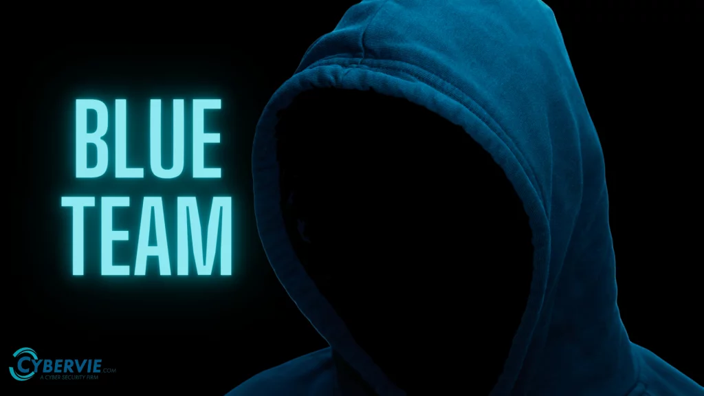

# Blue Team Defense System (BDSv1) - README

Donate for me over crypto BTC ADDRESS 
12zsQF6XgiNtu5SgGUgi5R66DwhTyPTSaN

  
*Banner image: Replace with your own blue team cybersecurity image for better visuals.*

## Overview
BDSv1 is a Python-based security monitoring tool designed for blue team operations, penetration testing, and anomaly detection. It integrates AI-based anomaly detection, heuristic analysis, process monitoring, behavior tracking, and web threat detection using a Web Application Firewall (WAF) mode. The tool leverages libraries like tshark (from Wireshark) and Suricata for real-time threat detection.

This script was developed to assist in identifying potential compromises, such as port scans, brute force attacks, suspicious processes, and web-based threats, while reducing alert noise through deduplication and behavior summarization.

## Features
- **Hybrid Detection:** Combines AI (Isolation Forest), heuristics, and rule-based monitoring.
- **Alert Types:** Supports detection for heuristic compromises, AI anomalies, port scans, brute force attempts, suspicious processes, and WAF threats.
- **Behavior Tracking:** Tracks and summarizes attacker behavior per IP or process to provide context in alerts.
- **WAF Monitoring Mode:** Focuses on web threats (e.g., SQL injection, XSS) with automatic rule downloads.
- **Real-time and Batch Alerting:** Options for immediate or interval-based alert outputs.
- **Automatic Rule Updates:** Downloads and extracts Suricata rules, including WAF-specific rules.
- **User Interface:** Interactive menu for selecting monitoring modes and interfaces.

## Requirements
- **Python 3.6+:** Ensure Python is installed.
- **Packages:** Automatically installs required packages (`psutil`, `numpy`, `scikit-learn`, `requests`) if missing.
- **Wireshark:** Installed with tshark executable (path: `C:\Program Files\Wireshark\tshark.exe` by default).
- **Suricata:** IDS/IPS tool for advanced rule-based detection (path: `C:\Program Files\Suricata\bin\suricata.exe` by default). Download from [Suricata IDS Website](https://suricata-ids.org/download/).
- **Dependencies:** Ensure Suricata and Wireshark are configured correctly. Update paths in the script if installed elsewhere.

## Installation
1. Clone or download the repository containing `blue_team.py`.
2. Install Python dependencies by running the script; it will auto-install missing packages.
3. Install Wireshark and ensure tshark is accessible.
4. Install Suricata:
   - Download from [https://suricata-ids.org/download/](https://suricata-ids.org/download/) or use Chocolatey (`choco install suricata`).
   - Verify installation by running `suricata -h` in the command prompt.
5. Update script paths if necessary:
   - `TSHARK_PATH`, `SURICATA_PATH`, `SURICATA_CONFIG`, and `SURICATA_LOG_DIR` are defined at the top of `blue_team.py`. Adjust them based on your system.

## Usage
1. Run the script with Python: `python blue_team.py`.
2. The script will:
   - Prompt for traffic capture to train the AI model.
   - Download and update Suricata rules.
   - Start Suricata in the background.
   - Present a monitoring menu.
3. Select from the menu:
   - **Option 1:** Real-time alerts for general monitoring.
   - **Option 2:** Batch alerts with custom intervals.
   - **Option 3:** WAF monitoring for web threats.
   - **Option 4:** Exit.
4. During monitoring, the script will detect and alert on threats, including behavior summaries.

## Troubleshooting
- **Suricata Not Found:** If you see a "FileNotFoundError", ensure Suricata is installed and update `SURICATA_PATH` in the script. Common path is `C:\Program Files\Suricata\bin\suricata.exe`.
- **tshark Not Found:** Install Wireshark and ensure it's in your PATH or update `TSHARK_PATH`.
- **No Alerts:** Verify network interfaces are correctly selected and traffic is flowing. Enable verbose mode for debugging.
- **WAF Rules Download Fails:** Check the `WAF_RULES_URL` in the script and ensure it's valid. Use alternative rule sources if needed.

## Contributing
This tool is for educational and authorized penetration testing purposes only. Feel free to modify or extend it. Contributions are welcome—submit issues or pull requests if you enhance it further.

## License
This script is provided under the MIT License. Use responsibly.
